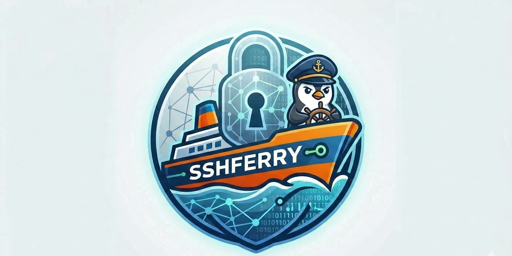

<p align="center">
  
</p>

# SSHFerry

[中文](README_zh.md) | English

SSHFerry is a multi-session SSH file transfer workspace focused on safe remote operations, visible task flow, and practical day-to-day transfer work.

## Overview

- 🖥️ Desktop client: Python + PySide6, currently the main runnable app
- 🧩 Backend service: FastAPI layer exposing local transfer APIs
- 🌐 Frontend app: React + Vite UI under active integration

## Highlights

- 🔒 `remote_root` sandbox protection for remote operations
- 📁 Upload and download for both files and folders
- 🔁 Resume and skip-aware transfer behavior
- 🧪 Built-in connection checks for TCP, SSH, SFTP, and write access
- 📊 Task center with pause, resume, cancel, and restart
- ⚡ Parallel chunk transfer for large files
- 🪟 Multiple remote sessions in one window
- 🔀 Remote-to-remote copy by drag and drop

## Architecture

### 🖥️ Desktop Client

- Runtime: Python `3.11+`
- UI: `PySide6`
- Entry: `python -m src.app.main`

### 🧩 Backend

- Runtime: Python `3.11+`
- Framework: `FastAPI` + `uvicorn`
- Entry: `python -m backend.app.main`

### 🌐 Frontend

- Runtime: Node.js
- Stack: `React` + `TypeScript` + `Vite`
- Dev server: `npm run dev` in `frontend/`

### 🚚 Transfer Engines

- `sftp`: default transfer engine
- `parallel`: chunked transfer for large files
- `scp`: manual override for overwrite-oriented behavior

### 📌 Task States

- `pending`
- `running`
- `paused`
- `done`
- `failed`
- `canceled`
- `skipped`

## Repository Layout

```text
src/        Desktop app, transfer engines, scheduler, shared models
backend/    FastAPI backend service
frontend/   React frontend
docs/       Architecture and migration docs
tests/      Pytest suite
tools/      Build and benchmark scripts
```

## Documentation

- 📘 Overview: [docs/README.md](docs/README.md)
- 🧱 Frontend build notes: [docs/frontend/FRONTEND_BUILD.md](docs/frontend/FRONTEND_BUILD.md)
- 🔌 Frontend API notes: [docs/frontend/FRONTEND_API.md](docs/frontend/FRONTEND_API.md)
- 🛠️ Backend worklist: [docs/backend/BACKEND_TODO.md](docs/backend/BACKEND_TODO.md)
- 🗂️ Historical architecture notes: [docs/architecture/agent.md](docs/architecture/agent.md)

## Quick Start

### 1. Install Python dependencies

```bash
pip install -r requirements.txt
```

### 2. Run the desktop client

Windows:

```powershell
./run.bat
```

Cross-platform:

```bash
python -m src.app.main
```

### 3. Run the backend

```bash
python -m backend.app.main
```

Optional environment variables:

- `SSHFERRY_BACKEND_HOST`
- `SSHFERRY_BACKEND_PORT`
- `SSHFERRY_ALLOWED_ORIGINS`
- `SSHFERRY_LOCAL_TOKEN`

### 4. Run the frontend

```bash
cd frontend
npm install
npm run dev
```

Build:

```bash
cd frontend
npm install
npm run build
```

## Desktop Workflow

1. ➕ Add a site manually or import from an SSH command.
2. 🧭 Set `remote_root` to a dedicated directory when possible.
3. 🧪 Run the connection check.
4. 🪟 Open one or more remote sessions.
5. ⬆️⬇️ Upload or download files and folders.
6. 🔀 Drag between remote panels for remote-to-remote transfer.
7. 📊 Track and control progress in the task center.

Notes:

- Site default protocol can be `sftp` or `scp`
- Window-level override can force `Auto / SFTP / SCP`
- Empty `remote_root` falls back to `/`

## Verification

Run tests:

```bash
pytest -q
```

Quick import check:

```bash
python -c "from src.shared.models import SiteConfig, Task; from src.core.scheduler import TaskScheduler; from src.services.connection_checker import ConnectionChecker; print('imports_ok')"
```

## Packaging

Windows packaging currently targets the PySide6 desktop client.

Build:

```powershell
powershell -ExecutionPolicy Bypass -File .\tools\build_windows.ps1 -VenvPath .venv_compat
```

Debug build first:

```powershell
powershell -ExecutionPolicy Bypass -File .\tools\build_windows.ps1 -Clean -Debug -VenvPath .venv_compat
```

Release build:

```powershell
powershell -ExecutionPolicy Bypass -File .\tools\build_windows.ps1 -Clean -VenvPath .venv_compat
```

Wrapper:

```bat
tools\build_windows.bat
```

Output:

```text
release/SSHFerry-<version>-windows/
release/SSHFerry-<version>-windows.zip
release/SSHFerry-<version>-windows.sha256
```

Important notes:

- 📦 Publish the whole folder or generated `.zip`, not only the `.exe`
- 🧱 The build uses `onedir` layout for Qt runtime stability
- 🚫 UPX is disabled by default

## Performance Notes

- ⚡ Large files switch to parallel SFTP automatically after the threshold is reached
- 🎛️ Default preset policy is direction-aware
- 🧵 Scheduler concurrency is tuned by engine type

Default scheduler concurrency:

- `max_workers_total=3`
- `max_workers_sftp=3`
- `max_workers_scp=2`
- `max_workers_parallel=1`

Useful environment variables:

- `SSHFERRY_PARALLEL_WORKERS`
- `SSHFERRY_PARALLEL_CHUNK_BYTES`
- `SSHFERRY_PARALLEL_WARMUP_BATCH`
- `SSHFERRY_PARALLEL_WARMUP_DELAY`
- `SSHFERRY_PARALLEL_MAX_CHUNK_RETRIES`
- `SSHFERRY_STRICT_HOSTKEY`

Benchmark script:

```bash
python tools/benchmark_transfer.py --site "<your-site-name>" --size-mb 512 --iterations 2
```

## Storage And Safety

- 🔐 Passwords are not persisted by default
- 💾 If password saving is enabled, credentials are stored locally on the current machine
- 🧱 Prefer least-privilege accounts and a non-root `remote_root`

Site store path:

- Windows: `%USERPROFILE%\AppData\Local\SSHFerry\sites.json`
- Linux / macOS: `~/.config/sshferry/sites.json`

## Current Status

- ✅ The PySide6 desktop app is usable and remains the main entry point
- 🔌 The FastAPI backend is already wired into the core transfer logic
- 🚧 The React frontend is present and under active integration

If you are starting work with the project today, treat the desktop client as the stable path and the backend/frontend split as the next architecture being built out.
